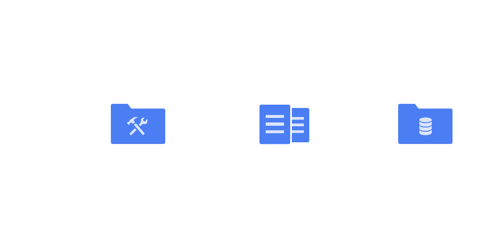
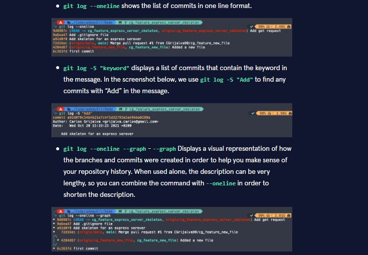

    - git init
- - - 
Inicializa repositório local vazio 

 

    - git status
- - -
Checa status dos arquivos do repositório local e mostra aqueles modificados 

 

    - git add (filename)
- - -
Adiciona arquivos ao git.

Obs: Podemos passar "*" como parametro para adicionar todos os arquivos ao git

 

    - git diff
- - - 
Mostra diferenças entre o arquivo atual e a versão adicionada ao git 

 

    - git commit -m "message"
- - -
Armazena os arquivos do git no repositório de forma permanente

- git commit -ammend 

Essa opção permite alterar o commit anterior. Supondo que você tenha feito um commit mas percebeu que algo estava errado, você pode alterar o commit anterior para refletir suas alterações. Sem que seja necessário criar um novo commit.

- git commit -ammend --no-edit
  
A opção --no-edit especifíca que a mensagem do commit não deve ser editada.

 

    - git log
- - -
Retorna uma lista com os commits feitos, contendo:

| SHA |
|---|
| Autor do commit |
| Data do commit |
| Menssagem do commit |

Variações do comando:

 

    - git show HEAD
- - -
Em Git, o commit em que se encontra atualmente é conhecido como o commit HEAD. Em muitos casos, o commit mais recentemente feito é o commit HEAD

 

    - git reset commit_SHA
- - -
Comando utilizado para resetar repositório ao estado do commit com o SHA passado

Obs: Somente os 7 primeiros caracteres são essenciais 

 

    - git stash
- - -
Restaura o repositório ao estado anterior ao stash temporaiamente para que você  possa fazer uma alteração em um commit passado e depois voltar ao estado que estava antes do stash sem perder alterações feitas.

 

Enquanto trabalha num ficheiro, encontra um pequeno bug num ficheiro separado de um commit anterior que precisa de ser corrigido antes de continuar.

- git stash

A execução do comando acima irá armazenar temporariamente num directório oculto o seu trabalho para utilização posterior.

Neste momento, pode mudar de branch e fazer o seu trabalho noutro local.

Uma vez corrigido o bug, quer recuperar o código em que estava a trabalhar anteriormente, você pode adicionar "pop" ao comando e assim recuperar o trabalho que foi armazenado quando usou o git stash.

- git stash pop

 

    - git alias commands
- - -

Caso você execute um comando com muita frequência, você pode criar um alias "atalho" para o mesmo. Usando o comando "git config":

- git config --global alias.co "checkout"

Sendo "co" o nome do alias e "checkout" o nome do comando que será executado.